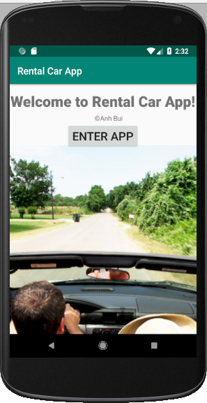
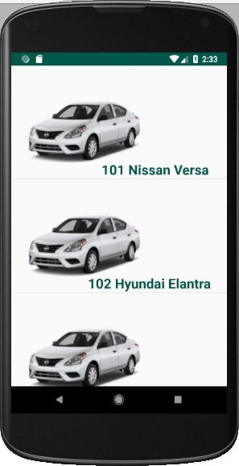
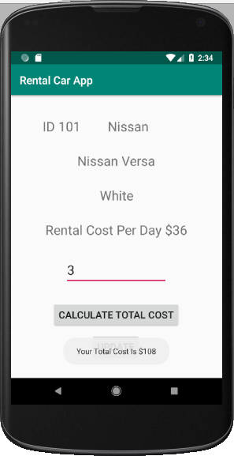
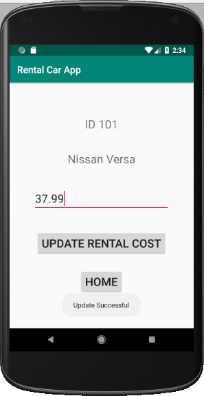
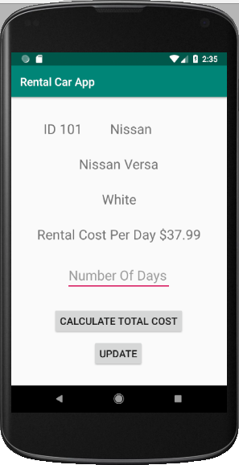

# AndroidApp-CarRentalAppWithRESTfulAPI
AndroidApp-CarRentalAppWithRESTfulAPI is an Android app which retrieve list of rental cars from a Cloud database (https://rentalcarapp-anhbui.firebaseio.com/). You can choose your rental car from a list, calculate the rental cost by number of days, and update the rental cost of each car to the Cloud database.

### Purpose:
A Rental Car app provides a listing of cars stored in the cloud. By selecting a car, users get info about the car and are allowed to calculate rental costs and update rental costs.

### Algorithm: 
1. An opening screen displays a welcome message (such as “Welcome to Rental Car App!”) and a button for users to go to the next screen.

2. The second screen displays a listing of cars (their id and name).   

3. When the user selects a car, a third screen displays the car’s Id, name, brand, color, rental cost per day, an input field used by customer representatives to enter the number of rental days, and a Calculate Total Cost button.

4. After the Calculate Total Cost button is “touched”, a “popup” message is displayed to show the total rental cost.  However, if the number of days is larger than 30, you show a message asking the customer representatives to call the phone number 512-777-2222. 

5. On the third screen, an Update button can be tapped to go to the fourth screen (the Update Rental Cost screen. 

6. The fourth screen displays the Id and name of the car, an input field used by customer representatives to enter the new rental cost per day, an Update Rental Cost per Day button to update the car’s rental cost per day, and a Home button to return to the opening screen.

### Conditions:	
1. Use a Rental Car Java object to provide the Id (integer), Name, Brand, Color, Rental Cost per Day (decimal number) for each car in the cloud. 
2. You must use a ListActivity object to display the list of cars. The arrays must be created (contained) in the ListActivity object. 
3. Each list item displays a car image and the name (such as Equinox) of each car in the list view. 
4. The rental car data must be stored in a cloud-based database (Firebase). 
5. You must enter at least five rental cars into your database.
6. You must use Rest API to connect to your database and perform database operations.   
